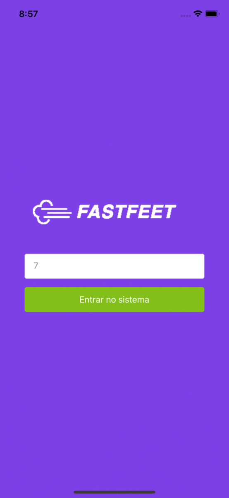

<h1 align="center">
  
</h1>

## :rocket: The project

The goal of this project is to manage deliveries of a shipping company. Is possible to sign start and finish deliveries, get details of a delivery, inform a problem in delivery and see your profile.

<h1 align="center">
  
</h1>

## :construction_worker: Technologies

For this project, we are using:

<ul>
  <li>React Native</li>
  <li>Styled Components</li>
  <li>Axios</li>
  <li>Redux</li>
  <li>Redux Saga</li>
  <li>Unform</li>
  <li>Date-fns</li>
  <li>Typescript</li>
  <li>React Native Camera</li>
  <li>Yup</li>
</ul>

## Running the project

This project was developed to IOS, so, to run, you first must have to change the API_URL in .env on API project. If your using localhost, change to your local IP, for example, 192.168.0.110. Then, if you have the react native CLI instaled in your computer, just execute the command:

    react-native run-ios

otherwise, run the command:

    yarn react-native run-ios

To finish a delivery, you must have to test in your physical device, because iPhone simulator doesn't have the option of use the camera. So, to do this, you have to have xcode installed in your machine. Then, you have to open the app.xcodeproj file that is located in ios folder and start the project in your physical device.

